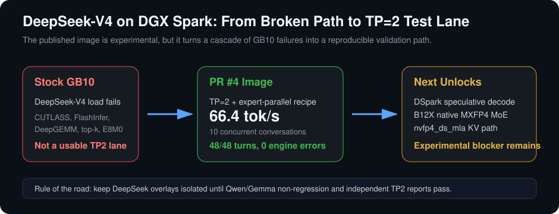
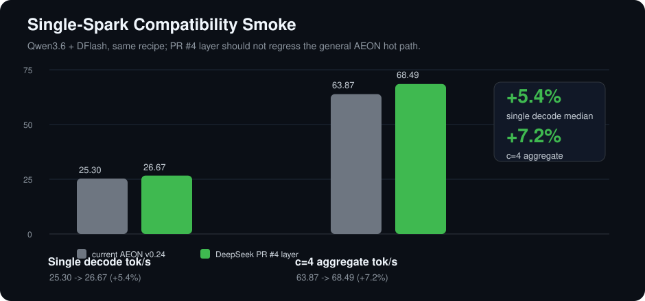
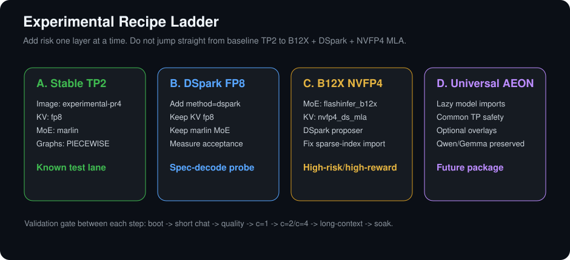

# AEON DeepSeek-V4 GB10 vLLM Experimental Image

[](https://github.com/users/AEON-7/packages/container/package/vllm-ultimate-deepseek-v4-gb10)
[](#current-status)
[](#-tips)

Experimental DeepSeek-V4 / DeepSeek-V4-Flash enablement layer for NVIDIA DGX Spark / GB10 / Blackwell.

This repository is intentionally separate from the production `aeon-vllm-ultimate` image. The goal is to let trusted testers validate the DeepSeek TP=2 path without risking regressions in the public Qwen/Gemma daily-driver container.

## Current Status

**Published experimental image:**

```text
ghcr.io/aeon-7/vllm-ultimate-deepseek-v4-gb10:experimental-pr4
ghcr.io/aeon-7/vllm-ultimate-deepseek-v4-gb10:2026-07-08-pr4-experimental
```

Use this image only if you are testing DeepSeek-V4 on GB10, especially 2-node TP=2. It is not the default AEON community image.

**Production image remains:**

```text
ghcr.io/aeon-7/aeon-vllm-ultimate:latest
```

That image is the promoted Qwen/Gemma path. It is faster and safer for Qwen3.6 today.

## What This Unlocks

This image packages the PR #4 DeepSeek-V4 GB10 enablement layer:

- DeepSeek-V4 / DeepSeek-V4-Flash startup on GB10 / SM 12.1-class Blackwell.
- A TP=2 + expert-parallel serve recipe for two DGX Sparks over RoCE.
- The dependency stack needed by the DeepSeek sparse-MLA path:
  - CUTLASS DSL 4.6 compatibility shim
  - DeepGEMM `nv_dev` SM120 kernels
  - FlashInfer 0.6.14 sparse-MLA API
  - `apache-tvm-ffi==0.1.11` + `tilelang==0.1.11`
  - GB10-safe `persistent_topk` routing
  - E8M0 scale upcast fixes
- A path toward DSpark speculative decoding on GB10.

The most important practical result: stock/dirty DeepSeek-V4 GB10 runs tend to die on kernel, dependency, or graph-capture issues. This layer moves the model from "does not reliably boot on DGX Spark TP=2" toward a reproducible TP=2 test lane.

## Attribution

The DeepSeek-V4 GB10 enablement layer is based on [AEON-7/vllm-ultimate-dgx-spark PR #4](https://github.com/AEON-7/vllm-ultimate-dgx-spark/pull/4), submitted by [@gilby](https://github.com/gilby). The original PR patches are archived in [`patches/upstream-pr4-gilby/`](patches/upstream-pr4-gilby/) with the original contributor preserved as the Git author.

AEON-7 packaged, A/B tested, documented, and published this dedicated experimental image so the community can validate the work without destabilizing the main Qwen/Gemma `aeon-vllm-ultimate` path.

## Important Disclaimer

This is experimental.

- Do not treat this as production-ready.
- Do not use it as the default Qwen/Gemma image.
- Do not assume this universally unlocks TP=2 for every model.
- Do not use FULL decode CUDA graph replay for TP=2 DeepSeek; use `PIECEWISE`.
- The newer B12X / `nvfp4_ds_mla` DSpark layer is **not** the promoted image yet. It currently has a known overlay mismatch around `build_flashinfer_mixed_sparse_indices` and must be fixed before broad testing.

We are working toward a future universal `aeon-vllm-ultimate` image that cleanly separates common TP/runtime stability from model-family overlays. Until then, DeepSeek stays in this dedicated experimental repo.

## Performance Snapshot



### Single DGX Spark Compatibility A/B

This is a non-regression smoke using Qwen3.6 on one DGX Spark. It is not a DeepSeek TP2 throughput benchmark. The point is that the plain PR #4 layer can boot a normal AEON ModelOpt NVFP4 + DFlash workload without obvious performance collapse.



| Image | Single TTFT | Single TPOT | Single Decode | c=4 Aggregate |
|---|---:|---:|---:|---:|
| `aeon-vllm-ultimate:2026-07-01-v0.24.0` | 331.1 ms | 39.54 ms | 25.30 tok/s | 63.87 tok/s |
| `vllm-ultimate-deepseek-v4-gb10:experimental-pr4` | 328.1 ms | 37.50 ms | 26.67 tok/s | 68.49 tok/s |
| Delta | **-0.9% TTFT** | **-5.1% TPOT** | **+5.4% decode** | **+7.2% aggregate** |

Notes:

- Same Qwen3.6 recipe, same DFlash drafter, same FP8 KV cache, same reasoning-aware benchmark harness.
- One PR #4 warm run showed a single outlier at 1.6 tok/s on one reasoning prompt. Treat this as a reason to keep the image experimental until longer soaks pass.

### Target DeepSeek TP=2 Validation

The PR layer reports the following DeepSeek-V4-Flash TP=2 validation on 2x DGX Spark:

| Test | Result |
|---|---:|
| Single-stream decode | 16.6 tok/s |
| 10 concurrent multi-turn conversations | 66.4 aggregate tok/s |
| Benchmark turns | 48/48 completed |
| Engine errors | 0 |
| Stable graph mode | `PIECEWISE` |

That should be read as: the image turns an otherwise broken GB10 DeepSeek-V4 TP2 path into a testable one. It is not yet a universal claim for all checkpoints, all fabrics, or all graph modes.

## Experimental Recipes To Test Next



These are intentionally written as test recipes, not promises. The goal is to give multi-rig testers a shared ladder: first reproduce the known-good TP2 path, then add one risk at a time.

### Recipe A: Stable TP2 Baseline

This is the currently published path.

```text
image: ghcr.io/aeon-7/vllm-ultimate-deepseek-v4-gb10:experimental-pr4
model: DeepSeek-V4-Flash
tp: 2
expert_parallel: true
moe_backend: marlin
linear_backend: triton
kv_cache_dtype: fp8
cudagraph_mode: PIECEWISE
max_model_len: 65536
max_num_seqs: 8
max_num_batched_tokens: 4096
```

Use this to establish that your fabric, cache mounts, model files, and endpoint are healthy before trying DSpark or B12X.

### Recipe B: DSpark-First Trial

Theory: if the DSpark module is available and vLLM registers the `dspark` speculative method cleanly, add speculative decode while keeping the safer FP8 KV and non-B12X MoE path.

```text
base: Recipe A
model: DeepSeek-V4-Flash-DSpark or matching DSpark-enabled checkpoint
speculative_config:
  method: dspark
  num_speculative_tokens: 3
  draft_sample_method: probabilistic
keep:
  kv_cache_dtype: fp8
  moe_backend: marlin
  cudagraph_mode: PIECEWISE
```

Success criteria:

- `/v1/models` returns.
- First chat completes.
- Acceptance metrics are visible.
- c=1 and c=2 produce coherent output before testing c=4/c=8.

If this fails, it tells us DSpark needs the newer overlay lane rather than just the PR #4 runtime base.

### Recipe C: B12X + NVFP4 MLA High-Risk Lane

Theory: B12X is the path that could make native MXFP4 MoE and `nvfp4_ds_mla` practical on GB10, especially for DeepSeek-V4 distributed serving.

```text
base: deepseek-v4-gb10 layer
add:
  b12x==0.30.0
  flashinfer_b12x MoE backend
  nvfp4_ds_mla CacheDType
  DSpark proposer/scheduler overlays
target flags:
  --moe-backend flashinfer_b12x
  --kv-cache-dtype nvfp4_ds_mla
  --speculative-config '{"method":"dspark","num_speculative_tokens":3,"draft_sample_method":"probabilistic"}'
  --compilation-config '{"cudagraph_mode":"PIECEWISE","custom_ops":["all"]}'
```

Current blocker:

```text
ImportError: cannot import name 'build_flashinfer_mixed_sparse_indices'
```

Likely fix:

- Align `vllm/models/deepseek_v4/common/ops/__init__.py`, `cache_utils.py`, and `nvidia/flashinfer_sparse.py` from the same upstream overlay generation.
- Add an import smoke that checks `build_flashinfer_mixed_sparse_indices` exists before publishing.
- Then test Qwen non-regression, DeepSeek single-node boot, TP2 boot, and only then DSpark+B12X performance.

### Recipe D: Future Universal AEON Image

Long-term target: merge only the common-safe pieces into `aeon-vllm-ultimate`, while keeping model-family overlays optional.

```text
common runtime:
  PIECEWISE TP graph safety
  FlashInfer/CUTLASS/DeepGEMM dependency sanity
  lazy model-family imports
  GB10 SM120/SM121a build flags
model overlays:
  Qwen/Gemma DFlash path
  DeepSeek sparse-MLA path
  optional DSpark path
  optional B12X MXFP4 MoE path
```

## Quickstart: Pull The Image

```bash
docker pull ghcr.io/aeon-7/vllm-ultimate-deepseek-v4-gb10:experimental-pr4
```

Optional pinned tag:

```bash
docker pull ghcr.io/aeon-7/vllm-ultimate-deepseek-v4-gb10:2026-07-08-pr4-experimental
```

## Quickstart: Prepare The Model

On both DGX Spark nodes, place the model at the same path. Example:

```bash
mkdir -p /models/deepseek-ai
huggingface-cli download deepseek-ai/DeepSeek-V4-Flash \
  --local-dir /models/deepseek-ai/DeepSeek-V4-Flash \
  --local-dir-use-symlinks False
```

If you are testing a DSpark checkpoint/module, keep the same path convention and record the exact Hugging Face revision in your test report.

## Quickstart: TP=2 Serve

Assumptions:

- Two DGX Sparks.
- Same image on both nodes.
- Same model path on both nodes.
- RoCE fabric configured and visible inside Docker via `/dev/infiniband`.
- Fabric IPs are reachable between nodes.
- Ports `29519` and `8000` are available.

Clone this repo on both nodes:

```bash
git clone https://github.com/AEON-7/vllm-ultimate-deepseek-v4-gb10.git
cd vllm-ultimate-deepseek-v4-gb10
```

Head node:

```bash
IMAGE=ghcr.io/aeon-7/vllm-ultimate-deepseek-v4-gb10:experimental-pr4 \
MODEL_DIR=/models/deepseek-ai/DeepSeek-V4-Flash \
NODE_RANK=0 \
MASTER_ADDR=<head-fabric-ip> \
VLLM_HOST_IP=<head-fabric-ip> \
FABRIC_IF=<fabric-interface> \
NCCL_IB_HCA=<roce-hca> \
./scripts/serve-deepseek-v4-gb10-tp2.sh
```

Worker node:

```bash
IMAGE=ghcr.io/aeon-7/vllm-ultimate-deepseek-v4-gb10:experimental-pr4 \
MODEL_DIR=/models/deepseek-ai/DeepSeek-V4-Flash \
NODE_RANK=1 \
MASTER_ADDR=<head-fabric-ip> \
VLLM_HOST_IP=<worker-fabric-ip> \
FABRIC_IF=<fabric-interface> \
NCCL_IB_HCA=<roce-hca> \
./scripts/serve-deepseek-v4-gb10-tp2.sh
```

The script uses:

```text
--tensor-parallel-size 2
--enable-expert-parallel
--moe-backend marlin
--linear-backend triton
--kv-cache-dtype fp8
--max-model-len 65536
--max-num-seqs 8
--max-num-batched-tokens 4096
--gpu-memory-utilization 0.80
--compilation-config '{"cudagraph_mode":"PIECEWISE","custom_ops":["all"]}'
```

## Verify

On the head node:

```bash
curl http://127.0.0.1:8000/v1/models | jq
```

Then run:

```bash
python3 scripts/validate-endpoint.py --base-url http://127.0.0.1:8000/v1
```

Expected:

- `/v1/models` returns `DeepSeek-V4-Flash`.
- A short chat completes.
- No NCCL timeout.
- No `EngineCore encountered an issue`.
- No garbled output.

## Why PIECEWISE Graphs

The DeepSeek TP2 path is sensitive to graph-captured distributed collectives. The PR validation found that FULL decode graph replay can desync NCCL across the two ranks. For this image, `PIECEWISE` is the stable default.

Do not switch to `FULL` or `FULL_AND_PIECEWISE` during validation unless the test is explicitly designed to reproduce or debug the NCCL issue.

## DSpark Status

DeepSeek DSpark is a speculative decoding path that can improve per-user generation by proposing multiple tokens and verifying them in larger target passes. The PR #4 image provides much of the GB10 runtime foundation needed for DeepSeek-V4 and DSpark testing.

Current split:

- `experimental-pr4`: stable enough to publish as the DeepSeek-V4 GB10 TP2 test image.
- B12X / `nvfp4_ds_mla` / DSpark refinement image: not promoted yet; current blocker is an overlay mismatch around `build_flashinfer_mixed_sparse_indices`.
- Future target: one universal AEON image with optional model-family overlays for Qwen, Gemma, DeepSeek, DSpark, and B12X.

## Known Issues

| Area | Status |
|---|---|
| Qwen/Gemma default serving | Use `ghcr.io/aeon-7/aeon-vllm-ultimate:latest`, not this repo |
| DeepSeek TP2 | Experimental, needs more independent tester reports |
| FULL CUDA graph mode | Known risk for NCCL desync on TP2 |
| B12X / MXFP4 MoE | Promising, but not promoted in this image |
| `nvfp4_ds_mla` KV | Experimental B12X lane only |
| DSpark speculative config | Active development; report exact model/checkpoint/revision |

## Tester Report Template

```text
Tester:
Hardware:
Node count:
OS / driver:
CUDA runtime:
Image tag:
Repo commit:
Model checkpoint:
Model revision:
Fabric interface:
NCCL settings:

Build or pull result:
Import smoke:
Launch command:
Health check:

c=1 TTFT / TPOT / decode:
c=2 TTFT / TPOT / aggregate:
c=4 TTFT / TPOT / aggregate:
c=8 TTFT / TPOT / aggregate:
Long-context result:
Soak duration:

Errors / stack traces:
Output quality notes:
Thermals:
Recommendation:
```

## Roadmap

1. Fix the B12X overlay mismatch and re-test the `nvfp4_ds_mla` path.
2. Validate DSpark speculative decoding with clear acceptance, TTFT, TPOT, and quality metrics.
3. Run TP=2 and TP=4 tests on independent multi-rig setups.
4. Extract common TP runtime fixes into the future universal `aeon-vllm-ultimate`.
5. Keep DeepSeek-specific sparse-MLA and B12X code isolated until it is proven safe for unrelated models.

## ☕ Tips

If this work saves you time or helps your local AI lab, tips help fund more DGX Spark testing, public containers, and benchmark documentation.

Use the crypto payment details from the main [AEON-7 profile](https://github.com/AEON-7) or the payment section in the model card where this repository is linked.
